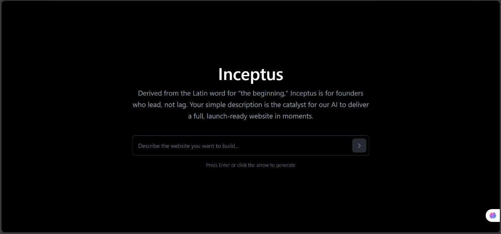
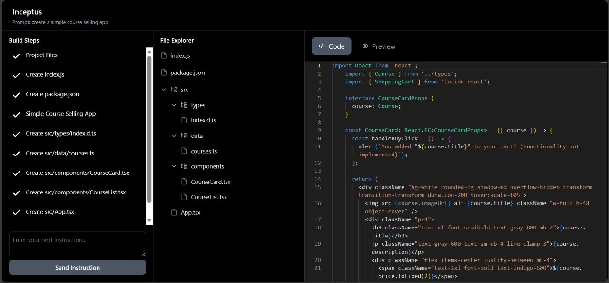

# Inceptus - The AI Powered Web Application Factory

🔗 [https://inceptus1.vercel.app/](https://inceptus1.vercel.app/)

Inceptus is not just a tool; it's a revolutionary, zero-setup development environment that instantly transforms natural-language ideas into fully functional web applications. Inspired by the visionary concept of V0 and Bolt, Inceptus brings the future of rapid application development directly into your browser.

### Homepage UI



### Builder Interface



## Overview

Inceptus is a browser-based AI development powerhouse. Describe any website or application you want to build, and Inceptus immediately generates the complete project structure, production-ready code, and a live preview.

The magic happens under the hood: your prompt is processed, enhanced by a structured prompt-engineering backend, and sent to the Gemini API. The resulting step-wise instructions and code are then materialized and executed within an in-browser WebContainer environment.

## Key Features

- **Single-Prompt Generation:** Generate entire, complex web applications from a simple descriptive sentence.
- **Instant Scaffolding:** Automatic project creation, file structuring, and dependency management.
- **Live, In-Browser Environment:** Code execution and live preview powered by WebContainers running Node.js fully on the client side meaning no setup and no external servers.
- **Seamless Editing:** Integrated real-time code editing with the powerful Monaco Editor.
- **Iterative AI Refinement:** Continuously evolve your application using follow-up prompts. Add features, modify components, or fix bugs by simply telling the AI what you need next.
- **Enhanced Code Quality:** A proprietary structured prompt-engineering layer ensures the Gemini model delivers accurate, reliable, and well-structured code.

## Project Workflow

This is how Inceptus translates an abstract idea into a tangible, runnable application in a matter of moments:

1. **Idea Input:** The user articulates their vision:
   > “Create a task manager with a sidebar, dark mode, and local storage support.”
2. **Intelligent Processing (Backend):** The core backend receives the request and executes a prompt-engineering layer. It clarifies ambiguities, adds system-level constraints, and structures the request to maximize the LLM's comprehension and output quality.
3. **Gemini Execution:** The enriched prompt is sent to the Gemini API. The model responds with a structured plan, including high-level steps, exact file paths to create/modify, and the complete, corresponding code snippets.
4. **Instruction Parsing:** The system parses this structured output, translating the LLM's code generation instructions into actionable, project-level file operations.
5. **Virtual File Generation:** The complete project structure is created or updated within a virtual filesystem inside the browser, instantly forming a professional, standards-compliant codebase.
6. **WebContainer Deployment:** The entire codebase is mounted into a WebContainer instance, activating a virtual Node.js environment right in the user's browser tab.
7. **Instant Live Preview:** A local development server spins up inside the WebContainer, providing an instant, secure, and fully functional live preview that updates instantly with every change.
8. **Continuous Iteration:** The user can continue the conversation:
   > “Add subtle fade-in animations to the task list,” or “Make the sidebar collapsible.”
   The system seamlessly integrates these updates, repeating the process from step 2 to evolve the application dynamically.

## Getting Started

### Prerequisites

- Node.js 18 or higher
- Google Gemini API Key

### Installation

```bash
git clone https://github.com/vasvigarg/inceptus.git
cd inceptus
```

#### 1. Backend Setup

```bash
cd backend
npm install
```

Add your Gemini API key to a new `.env` file:

```env
GEMINI_API_KEY=your_api_key
```

Start the backend server:

```bash
npm run dev
```

#### 2. Frontend Setup

Open a new terminal window:

```bash
cd frontend
npm install
npm run dev
```

The application will be live and ready for use at: http://localhost:5173

## Now Accepting Contributions

Inceptus thrives on collaboration. We welcome contributions of all types- from critical bug fixes and new feature development to documentation improvements and architectural enhancements.

### How to Contribute

1. Fork the repository on GitHub.
2. Clone your fork locally:
   ```bash
   git clone https://github.com/<your-username>/inceptus1.git
   ```
3. Create a new branch for your feature or fix:
   ```bash
   git checkout -b feature/your-new-feature
   ```
4. Make your changes locally.
5. Commit your work with a clear message:
   ```bash
   git add .
   git commit -m "feat: Implement the new <feature name>"
   ```
6. Push your branch:
   ```bash
   git push origin feature/your-new-feature
   ```
7. Open a Pull Request on GitHub, describing the purpose and scope of your changes.

## License

MIT License © 2025 Vasvi Garg
